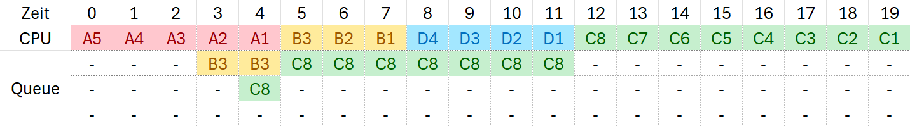
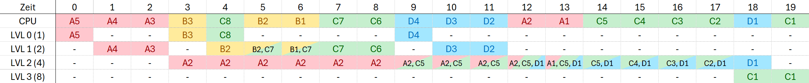
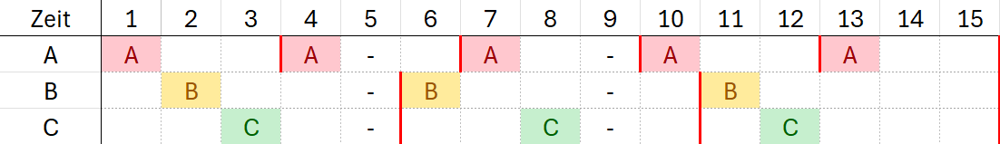

# Scheduling

## Scheduling
Eine zentrale Aufgabe eines Betriebssystems ist das sogenannte Scheduling. 
Welche Eigenschaften besitzt ein gutes Schedulingverfahren?
- **Hohe Effizienz**: Hohe Auslastung des Prozessors
- **Geringe Antwortzeit** bei interaktiven Prozessen
- **Fairness** durch gerechte Verteilung der CPU-Leistung und Wartezeit unter den Prozessen

### Beispiele
Für die folgenden Schedulingstrategien nutzen wir folgende Prozesse:

| Prozess      | A | B | C | D |
|--------------|---|---|---|---|
| Ankunftszeit | 0 | 3 | 4 | 8 |
| Dauer        | 5 | 3 | 8 | 4 |
| Priorität    | 4 | 1 | 2 | 3 |

#### FCFS
Beim klassichen FCFS (First Come First Served) werden Prozesse in ihrer Ankunftsreihenfolge abgearbeitet. Dieses Verfahren ist nicht verdrängend. Die Queue wird anhand der weiteren Ankunftsreihenfolge aufgefüllt. 

#### Prio-NP
Beim scheduling Verfahren Priority - Non Preemptive werden Prozesse anhand ihrer Priorität abgearbeitet. Ein Prozess mit einer höheren Priorität wird entsprechend höher in der Warteschlange (Queue) positioniert. Auch dieses Verfahren ist nicht präemptiv.  

#### SRTN
Beim SRTN (Shortest Remaining Time Next) Verfahren werden Prozesse anhand ihrer Ausführungsdauer/Bedienzeit abgearbeitet. Ein kürzerer Prozess (d.h. kürzere Bedienzeit) wird hierbei vorgezogen und verdrängt einen bereits laufenden Prozess, sofern die Restlaufzeit geringer ist. 

#### Round Robin ($\tau$ = 2)
Beim Round-Robin Verfahren wechseln sich die Prozesse alle $\tau$ Zeiteinheiten ab. In unserem Fall läuft ein Prozess für $\tau = 2 $ Zeiteinheiten, bevor dieser verdrängt und durch einen bereits wartenden Prozess ersetzt wird. Der verdrängte Prozess reiht sich am Ende der Warteschlange (auch nach neu ankommenden Prozessen) ein. 

Für das Round Robin Verfahren existiert folgende Checkliste:
1. **Kommt ein neuer Prozess an?** Wenn ja, so wird dieser am Ende der Queue eingefügt
2. **Ist das Quantum abgelaufen?** Wenn ja, so wird der Prozess, der die CPU belegt am Ende der Queue eingefügt
3. **Ist die CPU ungenutzt?** Wenn ja, so wird in der Queue nachgeschaut, ob Prozesse warten. Dem Obersten (dem Prozess, der am längsten wartet) wird die CPU für die Länge eines Quantums ($\tau$) zur Verfügung gestellt. 

#### MLF
Das MLF Verfahren ist von den bisher genannten am kompliziertesten - aber keine Sorge, auch dieses ist machbar! In der Aufgabenstellung ist die Zeitscheibe $\tau$ gegeben als $\tau_i = 2^i$ mit $i \in \{0, 1, \ldots\}$. Anhand dieser Formel berechnen wir nun einige der Level mit der jeweils dazugehörigen Zeitscheibe: 

|  Level ($i$)  | Zeitscheibe ($\tau_i$) |
|:-------------:|:----------------------:|
|       0       |       $2^0 = 1$        |
|       1       |       $2^1 = 2$        |
|       2       |       $2^2 = 4$        |
|       3       |       $2^3 = 8$        |

Nun zur Funktionalität des Schedulingverfahrens. Jeder neu ankommende Prozess befindet sich zunächst im niedrigsten Level (Level 0). Je niedriger ein Level, desto höher ist die Priorität. Ein Prozess, welcher sich in Level 0 befindet, hat dementsprechend eine höhere Priorität als einer, der sich in Level 1 befindet. 

Ein Prozess kann jetzt so lange rechnen, bis die Zeitscheibe abgelaufen, oder der Prozess fertig ist. Ist der Prozess nach Ende der Zeitscheibe nicht fertig, so wird dieser in der nächsthöheren Ebene in die Warteschlange platziert. Wenn es auf dieser Ebene bereits einen wartenden Prozess gibt, so werden beide nach dem FCFS (Queue) Verfahren abgearbeitet. 

Neu ankommende Prozesse verdrängen (in diesem Modul) in der Regel keine bereits laufenden Prozesse - lest aber unbedingt die Aufgabenstellung um euch sicher zu sein! Das heißt ein Prozess in einer niedrigeren Ebene kommt erst zum Ende des aktuell laufenden Prozesses zur Ausführung. 

### Wartezeit und Antwortzeit
- Die Wartezeit ist die Zeit zwischen Ankunft und Beendigung, in der der Prozess nicht ausgeführt wird (d.h. wartet)
- Antwortzeit ist die Zeit zwischen Ankunft und Beendigung des Prozesses (= Wartezeit + Bedienzeit)

Die mittlere Warte-/Antwortzeit des Systems setzt sich aus der Gesamtwartezeit der Prozesse geteilt durch die Anzahl an Prozessen zusammen. Es wird damit die durchschnittliche Warte-/Antwortzeit eines Verfahrens bestimmt. Wir nutzen als Beispiel die Wartezeiten von FCFS. In diesem Fall haben wir eine gesamte Wartezeit von:
$$
\sum_{i = 1}^{4} w_i = 0 + 2 + 4 + 8 = 14
$$
Wir haben 4 Prozesse, also folgt eine Systemwartezeit von: $\frac{14}{4} = 3.5$. Analog für die Antwortzeit.

Für die oben gezeigten Schedulingverfahren gelten die folgenden Zeiten:

#### FCFS
| Prozess     |      System      |  A  |  B  |  C   |  D   |
|-------------|:----------------:|:---:|:---:|:----:|:----:|
| Wartezeit   |  $\frac{14}{4}$  |  0  |  2  |  4   |  8   |
| Antwortzeit |  $\frac{34}{4}$  |  5  |  5  |  12  |  12  |

#### PRIO-NP
| Prozess     |     System     | A | B  | C | D |
|-------------|:--------------:|:-:|:--:|:-:|:-:|
| Wartezeit   | $\frac{20}{4}$ | 0 | 14 | 1 | 5 |
| Antwortzeit | $\frac{40}{4}$ | 5 | 17 | 9 | 9 |

#### SRTN
| Prozess     |     System     | A | B | C  | D |
|-------------|:--------------:|:-:|:-:|:--:|:-:|
| Wartezeit   | $\frac{10}{4}$ | 0 | 2 | 8  | 0 |
| Antwortzeit | $\frac{30}{4}$ | 5 | 5 | 16 | 4 |

#### RR ($\tau$ = 2)
| Prozess     |     System     | A | B | C  | D |
|-------------|:--------------:|:-:|:-:|:--:|:-:|
| Wartezeit   | $\frac{20}{4}$ | 4 | 4 | 8  | 4 |
| Antwortzeit | $\frac{40}{4}$ | 9 | 7 | 16 | 8 |

#### MLF
| Prozess     |     System     | A  | B | C  | D  |
|-------------|:--------------:|:--:|:-:|:--:|:--:|
| Wartezeit   | $\frac{25}{4}$ | 9  | 1 | 8  | 7  |
| Antwortzeit | $\frac{45}{4}$ | 14 | 4 | 16 | 11 |

## Periodische Prozesse
Ein periodischer Prozess ist ein Prozess, welcher innerhalb eines bestimmten Zeitraums immer wieder ausgeführt werden und vor einer bestimmten Deadline ausgeführt werden muss.

### Zulässiger Schedule
Ein zulässiger Schedule, d.h. eine gültige Reihenfolge der Prozesse, existiert, wenn folgende Formel gilt (_notwendige Bedingung_):
$$
\sum_{i = 1}^{n} \frac{D_i}{P_i} \leq 1
$$

### Ratenmonotonisches Verfahren
Ratenmonotones Verfahren (rate monotonic scheduling)
➢ Statische Priorität für jeden Prozess, die umgekehrt proportional ist zu der Periode,
höhere Priorität verdrängt niedrige Priorität
➢ Prozess mit der kleinsten Periode hat die höchste Priorität
• Voraussetzung: Prozesse sind unabhängig und Sollzeitpunkte fallen mit den
Perioden zusammen

Hinreichende Bedingung:
$$
\sum_{i = 1}^{n} \frac{D_i}{P_i} \leq n \cdot \left(\sqrt[n]{2} - 1 \right)
$$

### Hyperperiode
$$
t_{\text{HP}} = \text{LCM}(P_i) = \text{LCM}(3, 5, 5) = 15
$$

### Beispiel
|  Prozesse  |  Dauer ($D$)  |  Periode ($P$)  |
|:----------:|:-------------:|:---------------:|
|     A      |       1       |        3        |
|     B      |       1       |        5        |
|     C      |       1       |        5        |

#### Zulässiger Schedule
$$
\sum_{i = 1}^{n} \frac{D_i}{P_i} = \left( \frac{1}{3} + \frac{1}{5} + \frac{1}{5} \right) \approx 0.73 \leq 1
$$

#### Ist RMS (Rate Monotonic Scheduling) ein gültiger Schedule?
$$
\sum_{i = 1}^{n} \frac{D_i}{P_i} = \left( \frac{1}{3} + \frac{1}{5} + \frac{1}{5} \right) \approx 0.73 \leq n \cdot \left( \sqrt[n]{2} - 1 \right) \approx 0.7798
$$

## Scheduling Verfahren
### Strategiealternativen

### Betriebsziele
- **Effizienz / Durchsatz**:
  - FCFS
  - LCFS
  - SJN
  - HRRN
  - PRIO-NP
  - RR
- **Antwortzeit**: 
  - SJN
  - SRTN
- **Fairness**: 
  - RR
  - HRRN

:::info[TODO]
    Complete Scheduling Verfahren
:::