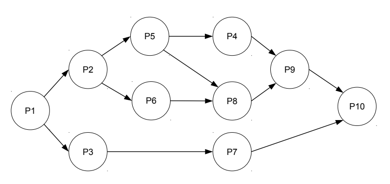
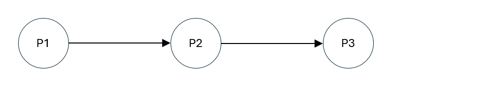
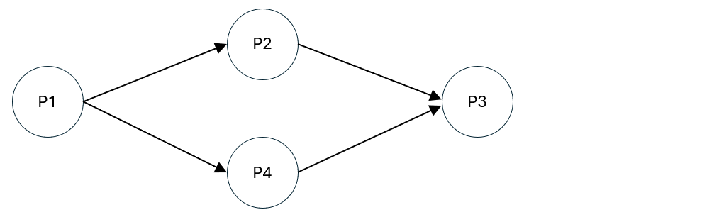

import Tabs from '@theme/Tabs';
import TabItem from '@theme/TabItem';

# C-Basics und Parallelisierung
## C-Basics
### Statischer Speicher (Stack)
Statischer Speicher, oft auch als "Stack" bezeichnet, ist ein Bereich im Arbeitsspeicher, der u.A. für die Speicherung von lokalen Variablen und Kontrollinformationen (bspw. Rücksprungadressen bei Funktionsaufrufen) verwendet wird. Der Zugriff auf den Stack ist sehr schnell, da die Größe und Lebensdauer der darauf gespeicherten Objekte zur Compile-Zeit bekannt sind und somit eine effiziente Verwaltung ermöglichen.

Allerdings ist die Größe des Stacks durch das Betriebssystem limitiert und deutlich kleiner im Vergleich zum Heap. Diese Beschränkung bedeutet, dass der Stack nicht für die Speicherung sehr großer Datenmengen oder für Objekte, deren Größe zur Compile-Zeit nicht bekannt ist, geeignet ist.

```c
void do_nothing() {
    int a = 1;
    int b = 2;    
}

int main() {
    do_nothing();
}
```
Variablen werden zum Ende ihrer Lebenszeit automatisch vom Stack entfernt. Im Beispiel oben werden innerhalb der Funktion `do_nothing` zwei Variablen `a` und `b` statisch angelegt - diese werden also dem Stack hinzugefügt. Sobald die Ausführung der Funktion beendet ist und wir zur `main` Funktion zurückkehren, werden diese vom Stack entfernt. Innerhalb der `main` Funktion kann also nicht mehr auf die Variablen `a` und `b` zugegriffen werden.

#### Anlegen statischer Variablen (Beispiel)
```c
int main() {
    int x = 0;
    int y[4] = {1,2,3,4};
}
```
Beide dieser Variablen `x` und `y` wurden auf dem Stack angelegt. Die Größen des `int`-Werts `x`, sowie des Arrays `y` sind zu Compile-Zeit bekannt. Sobald die Funktion `main` beendet ist, werden `x`und `y` automatisch vom Stack entfernt. 

### Dynamischer Speicher (Heap)
Im Gegensatz zum statischen Speicher ermöglicht der dynamische Speicher (Heap) die Speicherung von Objekten, deren Größe und Lebensdauer zur Laufzeit variieren können. Speicher auf dem Heap muss explizit angefordert (z.B. durch die Verwendung von `malloc` (memory allocate)) und freigegeben werden (z.B. durch Verwendung von `free`). Aufgrund der Tatsache, dass der Speicher manuell verwaltet werden muss, treten oft Fehler wie z.B. Memory-Leaks (d.h. das nicht-Freigeben von ungenutztem Speicher) auf. 

Im Gegensatz zum Stack, der oft auf wenige MB beschränkt ist, ist die theoretische Grenze des Heaps deutlich größer (oft >100TB). Der Heap ist daher besonders nützlich in Situationen, wo die Menge der benötigten Daten erst während der Laufzeit des Programms bestimmt werden kann, wie zum Beispiel bei der Bearbeitung von Benutzereingaben oder beim Lesen von Dateiinhalten unterschiedlicher Größe.

Zusätzlich ist die Geschwindigkeit des Heaps im Allgemeinen langsamer als die des Stacks. Das liegt bspw. daran, dass das Anlegen von Speicher im Heap durch das Betriebssystem koordiniert werden muss (mittels syscalls, die wiederum einen Kontextwechsel benötigen), welches zusätzlichen Overhead mit sich bringt. 

#### Anlegen dynamischer Variablen (Beispiel)
Um Speicher im Heap anzulegen, verwenden wir die Funktion `void* malloc(size_t size);`. Der Parameter `size` erwartet eine Anzahl an Bytes, die wir für unsere Zwecke reservieren wollen. 
Die Größe von Typen kann sich zwischen verschiedenen Architekturen unterscheiden. So ist bspw. eine `int` Variable auf einem 16-Bit-Prozessor in der Regel 2 Byte groß, wohingegen eine `int` Variable auf einem 64-Bit-Prozessor in der Regel 4 Byte groß ist. Wir können den `sizeof()` Operator nutzen, um die Größe eines Typs zu ermitteln. 

In unserem Beispiel wollen wir nun diese beiden Funktionen nutzen, um eine `int` Variable, sowie ein `int`-Array mit 4 Elementen auf dem Heap anzulegen. Dazu nutzen wir die Tatsache, dass uns `malloc` einen zusammenhängenden Speicherblock zurückgibt. Um ein Array auf dem Heap anzulegen, können wir also einen Block anfordern, der die Größe besitzt um 4 `int` Variablen speichern zu können. 

```c showLineNumbers
#include <stdlib.h> // Enthält Definition von malloc

int main() {
    int* a = malloc(sizeof(int)); // Entspricht malloc(4), sofern sizeof(int) == 4.
    int* b = malloc(4 * sizeof(int)); // Entspricht malloc(16), sofern sizeof(int) == 4.
    
    [...]
    
    free(a); // Speicher wieder Freigeben
    free(b);
}
```
Wir sehen, dass uns `malloc` einen Pointer (Zeiger) auf einen Block im Speicher gibt, der die angeforderte Größe besitzt. Im folgenden Abschnitt [Pointer](#pointer) schauen wir uns das etwas genauer an. 

:::danger[Achtung]
Die Funktion `malloc` kann, falls ein Fehler bei der Allozierung aufgetreten ist, `NULL` zurückgeben. Für unsere Beispiele lassen wir diese Überprüfung oft weg. In der realen Welt, sowie in den Praxis-Aufgaben dieses Moduls, sollte jedoch der Rückgabewert geprüft werden, bevor die Adresse genutzt wird - ungültige Lese-/Schreibzugriffe können zu Programmabstürzen führen!
:::

### Pointer
Ein Pointer ist eine Variable, die die Adresse einer anderen Variable im Speicher hält. Pointer sind nützlich, um Speicheradressen an Funktionen zu übergeben oder um direkt auf Speicherinhalte zuzugreifen. Obwohl sie sehr mächtig sind, kann ihre falsche Verwendung schnell zu Fehlern und Programmabstürzen führen.

```c
int a = 1;   // Wir legen die Variable a mit Wert 1 an
             // Durch &a erhalten wir die Adresse der Variable a. 
int* b = &a; // Hier speichern wir die Adresse der Variable a in der Variable b
```

Nach Ausführung des Code-Beispiels sieht der Speicher folgendermaßen aus (Adressen sind zur Veranschaulichung einfach gewählt). Wir sehen, dass die Variable `a` den Wert 1 enthält und an der Speicheradresse `0x4` gespeichert ist. Durch verwendung des Adressoperators (`&`) erhalten wir die Speicheradresse der Variable `a`. Diese speichern wir nun in der eigens dafür angelegten Variable `b`. Diese hat nun den Wert der Speicheradresse von `a`, also `0x4`.

| Adresse | Wert | Variable |
|:-------:|:----:|:--------:|
|   0x4   |  1   |    a     |
|   0x8   | 0x4  |    b     |
|   ...   |      |          |

Wir wissen also, wie wir die Adresse einer Variable erhalten. Jetzt wollen wir aber auf den Wert zugreifen, auf welche der "Zeiger" `b` zeigt. In unserem Fall ist dies nun also der Inhalt der Variable `a`. Um an den im Speicher enthaltenen Wert an der Adresse `0x4` zuzugreifen, können wir den Dereferenzierungsoperator `*` verwenden. Dieser gibt uns den Inhalt der Speicherzelle an der in der Variablen `b` gespeicherten Adresse zurück. In unserem Fall wäre also `*b == 1`.

Ein paar Beispiele:
```c
printf("%d", a);  // 1
printf("%p", &a); // 0x4
printf("%d", *b); // 1
printf("%p", b);  // 0x4
printf("%p", &b); // 0x8
```

### Beispiele
#### 1.
Welche Ausgabe produziert folgendes Programm? Warum?

```c showLineNumbers
#include <stdio.h>

void upgrade(int meinezahl) {
    meinezahl = 18;
}

int main() {
    int meinezahl = 5;
    upgrade(meinezahl);
    printf("%d\n", meinezahl);
}
```

<details>
  <summary>Lösung</summary>
  <div>
    Die Variable `meinezahl` wird kopiert und der Funktion `upgrade` übergeben. Die Funktion `upgrade` überschreibt die lokale Kopie der Variable mit dem Wert 18. Die "originale" Variable `int meinezahl`, welche in der `main` Funktion deklariert wurde, ist hiervon unberührt. Entsprechend wird 5 ausgegeben. 
  </div>
</details>

#### 2.
Welche Ausgabe produziert folgendes Programm? Warum?

```c showLineNumbers
#include <stdio.h>
#include <stdlib.h>

void upgrade(int* meinezahl) {
    *meinezahl = 18;
}

int main() {
    int* meinezahl = malloc(sizeof(int));
    *meinezahl = 5;
    upgrade(meinezahl);
    printf("%d\n", *meinezahl);
}
```

<details>
  <summary>Lösung</summary>
  <div>
    Die Variable `meinezahl` wird ebenfalls wieder kopiert und an die `upgrade` Funktion übergeben. Diesmal handelt es sich bei der Variable `meinezahl` aber um eine Variable vom Typ `int*`. Entsprechend kopieren wir keinen Wert, sondern kopieren eine Speicheradresse. Auf diese kann dann die `upgrade` Funktion mithilfe des Dereferenzierungsoperators (`*`) zugreifen. Da wir jetzt direkt an der Speicheradresse der Variable `meinezahl` schreiben, ändern wir somit auch den "korrekten" Wert. Als Ausgabe wird diesmal 18 ausgegeben. 
  </div>
</details>

#### 3.
Welche Zahl wird jetzt ausgegeben? Warum?
```c showLineNumbers
#include <stdio.h>
#include <stdlib.h>

void upgrade(int *meinezahl) {
    meinezahl = 18;
}

int main() {
    int *meinezahl = malloc(sizeof(int));
    *meinezahl = 5;
    upgrade(meinezahl);
    printf("%d\n", *meinezahl);
}
```
<details>
  <summary>Lösung</summary>
  <div>
    Wieder 5, obwohl call-by-reference. Es wird der Pointer manipuliert, nicht sein Inhalt geändert, da das Sternchen fehlt. Tatsächlich kommt es hier auch auf den genutzten Compiler an. Clang gibt einen Error aus und kompiliert das Programm nicht, während gcc nur eine Warnung ausgibt. _Getestet mit Clang Version 15.0.7 und gcc Version 12.2.1_
  </div>
</details>

#### 4.
Welchen Wert nehmen t1, t2 und t3 an? Warum? Zu welchen Fehlern kann das führen?
```c showLineNumbers
#include <stdio.h>
#include <stdlib.h>

typedef struct mystruct {
    int zahl1;
    int zahl2;
    int zahl3;
} mystruct;

int main() {
    mystruct test1;
    mystruct *test2 = malloc(sizeof(mystruct));
    int t1 = sizeof(mystruct);
    int t2 = sizeof(test1);
    int t3 = sizeof(test2);
    printf("t1: %d\nt2: %d\nt3: %d\n", t1, t2, t3);
}
```
<details>
  <summary>Lösung</summary>
  <div>
    t1 ist 12, da sizeof() die Große des Datentyps (=das struct mystruct) zurückgibt. t2 ist auch 12, obwohl sizeof() auf einer Variablen mit dem Datentyp mystruct aufgerufen wird. t3 ist aber 8 (oder 4 auf 32 Bit Systemen), da test2 ein Pointer ist, und die Große des Datentyps Pointer bestimmt wird. Mit Sternchen ware es aber wieder 12.
  </div>
</details>
---

## Parallelisierung
Die Parallelisierung ist eine wichtige Methode um Programmausführungen effizienter absolvieren zu können. Allerdings können wir nicht immer alle Prozesse simultan ausführen, da eventuell weitere Abhängigkeiten zwischen den Prozessen existiert. Abhängigkeitsgraphen sind eine Möglichkeit diese zu visualisieren.

`parbegin/parend` gruppiert Prozesse in Blöcke für simultane Ausführung und erfordert deren gemeinsames Ende, bevor fortgefahren werden kann, was eine blockweise Parallelität schafft. `fork/join` erlaubt individuelles Starten und Warten auf einzelne Prozesse zu beliebigen Zeitpunkten, was eine feingranulare und dynamische Parallelisierung ermöglicht. Wie wir im folgenden Beispiel sehen werden können unter Verwendung von `parbegin/parend` Informationen verloren gehen, wohingegen `fork/join` diese komplexeren Abhängigkeiten weiterhin enthält.

### Parbegin / Parend

Als Beispiel ist der folgende Graph gegeben:



#### Parbegin/Parend
<Tabs groupId="parbegin-parend">
  <TabItem value="description" label="Erklärung">
    Wir können feststellen, dass sich die Blöcke: $\{P2, P4, P5, P6, P8, P9\}$ und $\{P3, P7\}$ parallel ausführen lassen. Beide der Blöcke haben als Abhängigkeit lediglich den Prozess $P1$. Prozess $P10$ hat beide dieser Blöcke als Abhängigkeit und wird daher linear ausgeführt. 
    
    Entsprechend sieht der Anfang unseres `parbegin/parend` Pseudocodes folgendermaßen aus:
    ```
    P1;
    parbegin
        begin
            P2;
            ...
        end

        begin
            P3;
            P7;
        end
    parend
    P10;
    ```

    Wir führen zunächst Prozess $P1$ aus. Sobald dieser fertig ist, starten wir die Parallelisierung der beiden oben genannten Blöcke. Innerhalb des zweiten Blocks haben wir lediglich lineare Abhängigkeiten, sodass wir diese direkt hintereinander ausführen können. Dies ist im Pseudocode ebenfalls im zweiten begin/end Block vermerkt.  

    Der erste begin/end Block ist jedoch noch unvollständig. Da es dort weitere Abhängigkeiten zwischen den Prozessen gibt (bspw. $P5 \rightarrow P8$), können wir diese **nicht** einfach linear ausführen. Wir stellen nun fest, dass wir aber die Prozesse $\{P5, P6\}$ parallel ausführen können, da sich diese die Abhängigkeit des Prozesses $P2$ teilen. Wir fügen unserem Pseudocode entsprechend eine neue `parbegin/parend` Sektion zu. 

    ```c {5-8}
    P1;
    parbegin
        begin
            P2;
            parbegin
                P5;
                P6;
            parend
            ...
        end

        begin
            P3;
            P7;
        end
    parend
    P10;
    ```

    Fast geschafft! Es fehlen nun nur noch die Prozesse $\{P4, P8, P9\}$ innerhalb des oberen Blocks. Hier stellen wir nun die oben genannte Problematik des `parbegin/parend` Verfahrens fest. Durch die blockbasierte Parallelisierung müssen wir nun darauf warten, dass sowohl Prozess $P5$ als auch Prozess $P6$ terminieren, bevor wir fortfahren können. Dies ist jedoch eigentlich gar nicht notwendig, da der Prozess $P4$ nur den Prozess $P5$ als Abhängigkeit besitzt. Wir schauen uns gleich an, wie wir das Problem mit `fork/join` umgehen können. Aber nun zurück zum Thema. Prozesse $P5$ und $P6$ sind nun beide abgeschlossen. Wir erfüllen somit also alle Voraussetzungen um die Prozesse $\{P4, P8\}$ parallel ausführen zu können. Unser Pseudocode sieht nun aus wie folgt:

    ```c {10-13}
    P1;
    parbegin
        begin
            P2;
            parbegin
                P5;
                P6;
            parend

            parbegin
                P4;
                P8;
            parend
            ...
        end

        begin
            P3;
            P7;
        end
    parend
    P10;
    ```

    Es fehlt jetzt nur noch der Prozess $P9$, welcher sowohl $P4$ als auch $P8$ als Abhängigkeit besitzt. Wir können nun also $P9$ einfach linear hinzufügen. 

    ```c {14}
    P1;
    parbegin
        begin
            P2;
            parbegin
                P5;
                P6;
            parend

            parbegin
                P4;
                P8;
            parend
            P9;
        end

        begin
            P3;
            P7;
        end
    parend
    P10;
    ```

  </TabItem>
  <TabItem value="solution" label="Musterlösung">
        ```
        P1;
        parbegin
            begin
                P2;
                parbegin
                    P5;
                    P6;
                parend

                parbegin
                    P4;
                    P8;
                parend
                P9;
            end
            begin
                P3;
                P7;
            end
        parend
        P10;
        ```
  </TabItem>
</Tabs>

### Fork / Join
Die Fork / Join Methode mag auf den ersten Blick - im Vergleich zu `parbegin / parend` - etwas unverständlich erscheinen. Bei einem normalen (nicht parallelem) Fluss werden die Prozesse nacheinander ausgeführt. 
```
P1;
P2;
P3;
```
Hier kann $P2$ erst ausgeführt werden, wenn $P1$ beendet wurde und $P3$ erst dann, wenn $P2$ ausgeführt wurde. Der Abhängigkeitsgraph sieht folgendermaßen aus:


Angenommen wir fügen jetzt einen Prozess hinzu, der parallel zu $P2$ ausgeführt werden kann. Dann sähe der Abhängigkeitsgraph folgendermaßen aus:


Der dazugehörige `fork/join` Pseudocode:
```c showLineNumbers
P1;
fork P4;
P2;
join P4;
P3;
```
Dieser Pseudocode sagt:
1. Führe $P1$ aus.
2. Sobald $P1$ fertig ist: starte $P4$ parallel.
3. Führe $P2$ aus. Beachtet, dass dies unabhängig vom Zustand von $P4$ passiert, da wir $P4$ parallel ausführen. Wir warten an dieser Stelle also bspw. nicht darauf, dass der Prozess fertig ist. 
4. Sobald $P2$ fertig ist: warte darauf, dass $P4$ beendet.
5. An diesem Punkt sind sowohl $P2$ (aus dem normalen Fluss) und $P4$ (durch `join`) beendet. Wir führen jetzt also $P3$ aus.

Wenn wir das `join P4` (4) weggelassen hätten, würde dies bedeuten, dass der Prozess $P3$ ausgeführt werden kann, ohne, dass der Prozess $P4$ abgeschlossen ist. 

---

<Tabs groupId="fork-join">
  <TabItem value="description" label="Erklärung">
    Wir betrachten erneut folgenden Graphen:

    

    Zunächst stellen wir wieder fest, dass die Prozesse $P2, P3$ jeweils $P1$ als Abhängigkeit besitzen. Im Gegensatz zu `parbegin / parend` haben wir keine blockbasierte Parallelisierung mehr, sondern können Abhängigkeiten genau darstellen. Aufgrund der Komplexität des oberen Abschnitts, d.h. der Prozesse $\{P2, P4, P5, P6, P8, P9\}$, empfiehlt es sich hierfür einen separaten Block zu deklarieren. Diesen nennen wir `A`. Der Beginn des `fork/join` Pseudocodes sieht also folgendermaßen aus:

    ```
    P1;
    fork A;
    P3;
    ...

    A: 
        ...
    ```

    Wir schauen uns zunächste den unteren Teil an, d.h. die Prozesse $\{P3, P7, P10\}$. Aus dem Graphen können wir feststellen, dass Prozess $P7$ von $P3$ und Prozess $P10$ von $\{P7, P9\}$ abhängt. Da Prozess $P9$ auch das Ende des oberen Blocks `A` signalisiert, können wir den Pseudocode folgendermaßen anpassen:

    ```c {4-6}
    P1;
    fork A;
    P3;
    P7;
    join A;
    P10;

    A: 
        ...
    ```

    Jetzt schauen wir uns den oberen Block an. D.h. also die Prozesse $\{P2, P4, P5, P6, P8, P9\}$. Hier lässt sich ebenfalls direkt erkennen, dass Prozess $P2$ zuerst ausgeführt werden muss, bevor die Prozesse $\{P5, P6\}$ ausgeführt werden können. Wir passen unseren Block `A` an:

    ```c {9-11}
    P1;
    fork A;
    P3;
    P7;
    join A;
    P10;

    A: 
        P2;
        fork P6;
        P5;
        ...
    ```

    Im normalen Fluss sind jetzt Prozesse $P2$ und $P5$ abgeschlossen. Prozess $P4$ besitzt als einzige Abhängigkeit den Prozess $P5$, sodass wir diesen direkt ausführen können. Prozess $P8$ hingegen besitzt als Abhängigkeiten die Prozesse $\{P5, P6\}$. Da Prozess $P4$ jedoch nicht auf die Beendigung des Prozesses $P6$ warten muss, können wir diesen direkt "losschicken". Damit $P8$ ausgeführt werden kann, muss $P6$ abgeschlossen sein. Dies können wir mittels `join P6` erreichen. 

    ```c {12-14}
    P1;
    fork A;
    P3;
    P7;
    join A;
    P10;

    A: 
        P2;
        fork P6;
        P5;
        fork P4;
        join P6;
        P8;
        ...
    ```
    
    Nun fehlt nur noch der Prozess $P9$. Dieser besitzt als Abhängigkeit die Prozesse $\{P4, P8\}$. Im normalen Fluss ist Prozess $P8$ bereits abgeschlossen. Wir müssen nun also noch auf die Beendigung des Prozesses $P4$ warten um im Anschluss $P9$ ausführen zu können. Auch hierfür nutzen wir wieder `join P4`.

    ```c {15-16}
    P1;
    fork A;
    P3;
    P7;
    join A;
    P10;

    A: 
        P2;
        fork P6;
        P5;
        fork P4;
        join P6;
        P8;
        join P4;
        P9;
        end
    ```

  </TabItem>
  <TabItem value="solution" label="Musterlösung">
        ```
        P1;
        fork A;
        P3;
        P7;
        join A;
        P10;


        A:
            P2;
            fork P6;
            P5;
            fork P4;
            join P6;
            P8;
            join P4;
            P9;
            end
        ```
  </TabItem>
</Tabs>