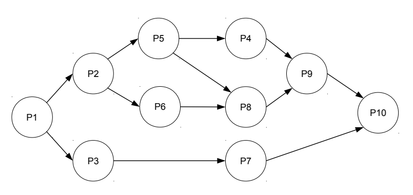

import Tabs from '@theme/Tabs';
import TabItem from '@theme/TabItem';

# Woche 1

## C Wiederholung
Die Programmiersprache C gilt als eine der grundlegendsten und einflussreichsten Sprachen in der Welt der Softwareentwicklung. Entwickelt in den frühen 1970er Jahren von Dennis Ritchie bei den Bell Labs, zeichnet sich C durch seine Effizienz und Flexibilität aus. Ein Schlüsselmerkmal von C ist die Fähigkeit, Operationen auf einer sehr niedrigen Ebene auszuführen, was direkte Manipulation von Hardware-Ressourcen wie Speicheradressen ermöglicht. Diese Fähigkeit macht C besonders wertvoll für die Entwicklung von Systemsoftware.


### Statische Variablen
Stack-Variablen werden bei Funktionsaufrufen dynamisch angelegt und automatisch freigegeben, wenn die Funktion endet. Sie ermöglichen schnellen Zugriff und effiziente Speicherverwaltung.
```c
int x = 5;
```

### Dynamische Variablen
Heap-Allozierungen bieten dynamischen Speicherplatz, der zur Laufzeit angefordert und explizit durch den Programmierer freigegeben werden muss. Dies ermöglicht Flexibilität bei der Speicherverwaltung.

Mit Hilfe der Funktion `malloc` (memory allocate), können wir Speicher vom Betriebssystem anfordern. Die Anzahl der Bytes die wir allozieren möchten übergeben wir als Parameter an die Funktion. Zusätzlich nutzen wir die Funktion `sizeof` um die Größe des Integer Datentyps festzustellen, da diese nicht zwangsläufig bei allen Architekturen gleich ist. 

Die Funktion gibt uns als Rückgabe einen [Zeiger](#pointer--zeiger) (dies lässt sich durch das `*`)
```c
// sizeof(int) = 4
int* x = malloc(sizeof(int));
```

:::warning[Achtung]
Die Funktion `malloc` kann, falls ein Fehler bei der Allozierung aufgetreten ist (bspw., falls kein Speicher mehr zur Verfügung steht) `NULL` zurückgeben. Für unsere Beispiele lassen wir diese Überprüfung oft weg. In der realen Welt sollte jedoch der Rückgabewert validiert werden, bevor an diese Adresse geschrieben wird - ungültige Lese-/Schreibzugriffe können zu Programmabstürzen führen!
:::

### Statische vs. Dynamische Allozierung
Der Hauptunterschied liegt in der Lebensdauer und Verwaltung: Stack-Variablen haben eine kurze, automatisch verwaltete Lebensdauer, während Heap-Allozierungen länger leben und manuell verwaltet werden müssen, was zu mehr Flexibilität, aber auch zu potentiellen "Memory-Leaks" führen kann.

Darüber hinaus befinden sich die Stack und Heap Addressen in unterschiedlichen Speicherbereichen. In der Regel wächst 

### Pointer / Zeiger
Ein Pointer (in C) ist eine Variable, die die Adresse einer anderen Variable im Speicher hält. Pointer sind nützlich, um Speicheradressen an Funktionen zu übergeben oder um direkt auf Speicherinhalte zuzugreifen. Obwohl sie sehr mächtig sind, kann ihre falsche Verwendung schnell zu Fehlern und Programmabstürzen führen.

```c
int a = 1;   // Wir legen die Variable a mit Wert 1 an
             // Durch &a erhalten wir die Adresse der Variable a. 
int* b = &a; // Hier speichern wir die Adresse der Variable a in der Variable b
```

Nach Ausführung des Code-Beispiels sieht der Speicher folgendermaßen aus (_Adressen sind zur Veranschaulichung einfach gewählt_). Wir sehen, dass die Variable `a` den Wert `1` enthält und an der Speicheradresse `0x4` gespeichert ist. Durch verwendung des Adressoperators (`&`) erhalten wir die Speicheradresse der Variable `a`. Diese speichern wir nun in der eigens dafür angelegten Variable `b`. Diese hat nun den Wert der Speicheradresse von `a`, also `0x4`. 
| Adresse  | Wert  | Variable  |
|:---:|:---:|:---:|
| 0x4  | 1 | a  |
| 0x8  | 0x4 | b  |
| ...  |   |   |

Wir wissen also, wie wir die Adresse einer Variable erhalten. Jetzt wollen wir aber auf den Wert zugreifen, auf welche der "Zeiger" `b` zeigt. In unserem Fall ist dies nun also der Inhalt der Variable `a`. Um an den im Speicher enthaltenen Wert an der Adresse `0x4` zuzugreifen, können wir den Dereferenzierungsoperator `*` verwenden. Dieser gibt uns den Inhalt an der in der Variablen `b` gespeicherten Adresse zurück. 

Ein paar Beispiele:
```c
printf("%d", a);  // 1
printf("%p", &a); // 0x4
printf("%d", *b); // 1
printf("%p", b);  // 0x4
printf("%p", &b); // 0x8
```

## Parallelisierung
Die Parallelisierung ist eine wichtige Methode um Programmausführungen effizienter absolvieren zu können. Allerdings können wir immer alle Prozesse simultan ausführen, da eventuell weitere Abhängigkeiten zwischen den Prozessen existiert. Abhängigkeitsgraphen sind eine Möglichkeit diese Abhängigkeiten visualisieren zu können.

### Unterschied
`parbegin/parend` gruppiert Prozesse in Blöcke für simultane Ausführung und erfordert deren gemeinsames Ende, bevor fortgefahren werden kann, was eine blockweise Parallelität schafft. `fork/join` erlaubt individuelles Starten und Warten auf einzelne Prozesse zu beliebigen Zeitpunkten, was eine feingranulare und dynamische Parallelisierung ermöglicht. Wie wir im folgenden Beispiel sehen werden können unter Verwendung von `parbegin/parend` Informationen verloren gehen, wohingegen `fork/join` diese komplexeren Abhängigkeiten weiterhin enthält. 

### Beispiel


Als Beispiel ist der folgende Graph gegeben:



#### Parbegin/Parend
<Tabs groupId="parbegin-parend">
  <TabItem value="description" label="Erklärung">
    Wir können feststellen, dass sich die Blöcke: $\{P2, P4, P5, P6, P8, P9\}$ und $\{P3, P7\}$ parallel ausführen lassen. Beide der Blöcke haben als Abhängigkeit lediglich den Prozess $P1$. 
    
    Entsprechend sieht der Anfang unseres `parbegin/parend` Pseudocodes folgendermaßen aus:
    ```
    P1;
    parbegin
        begin
            P2;
            ...
        end

        begin
            P3;
            P7;
        end
    parend
    P10;
    ```

    Wir führen zunächst Prozess $P1$ aus. Sobald dieser fertig ist, starten wir die Parallelisierung der beiden oben genannten Blöcke. Innerhalb des zweiten Blocks haben wir lediglich lineare Abhängigkeiten, sodass wir diese direkt hintereinander ausführen können. Dies ist im Pseudocode ebenfalls im zweiten begin/end Block vermerkt.  

    Der erste begin/end Block ist jedoch noch unvollständig. Da es dort weitere Abhängigkeiten zwischen den Prozessen gibt (bspw. $P5 \rightarrow P8$), können wir diese **nicht** einfach linear ausführen. Wir stellen nun fest, dass wir aber die Prozesse $\{P5, P6\}$ parallel ausführen können, da sich diese die Abhängigkeit des Prozesses $P2$ teilen. Wir fügen unserem Pseudocode entsprechend eine neue `parbegin/parend` Sektion zu. 

    ```
    P1;
    parbegin
        begin
            P2;
            parbegin
                P5;
                P6;
            parend
        end

        begin
            P3;
            P7;
        end
    parend
    P10;
    ```

    Fast geschafft! Es fehlen nun nur noch die Prozesse $\{P4, P8, P9\}$ innerhalb des oberen Blocks. Hier stellen wir nun die oben genannte Problematik des `parbegin/parend` Verfahrens fest. Durch die blockbasierte Parallelisierung müssen wir nun darauf warten, dass sowohl Prozess $P5$ als auch Prozess $P6$ terminieren, bevor wir fortfahren können. Dies ist jedoch eigentlich gar nicht notwendig, da der Prozess $P4$ nur den Prozess $P5$ als Abhängigkeit besitzt. Wir schauen uns gleich an, wie wir das Problem mit `fork/join` umgehen können. Aber nun zurück zum Thema. Prozesse $P5$ und $P6$ sind nun beide abgeschlossen. Wir erfüllen somit also alle Voraussetzungen um die Prozesse $\{P4, P8\}$ parallel ausführen zu können. Unser Pseudocode sieht nun aus wie folgt:

    ```
    P1;
    parbegin
        begin
            P2;
            parbegin
                P5;
                P6;
            parend

            parbegin
                P4;
                P8;
            parend
        end

        begin
            P3;
            P7;
        end
    parend
    P10;
    ```

    Es fehlt jetzt nur noch der Prozess $P9$, welcher sowohl $P4$ als auch $P8$ als Abhängigkeit besitzt. Wir können nun also $P9$ einfach linear hinzufügen. 

    ```
    P1;
    parbegin
        begin
            P2;
            parbegin
                P5;
                P6;
            parend

            parbegin
                P4;
                P8;
            parend
            P9;
        end

        begin
            P3;
            P7;
        end
    parend
    P10;
    ```

    Fertig!

  </TabItem>
  <TabItem value="solution" label="Musterlösung">
        ```
        P1;
        parbegin
            begin
                P2;
                parbegin
                    P5;
                    P6;
                parend

                parbegin
                    P4;
                    P8;
                parend
                P9;
            end
            begin
                P3;
                P7;
            end
        parend
        P10;
        ```
  </TabItem>
</Tabs>

#### Fork/Join
<Tabs groupId="fork-join">
  <TabItem value="description" label="Erklärung">
    TODO
  </TabItem>
  <TabItem value="solution" label="Musterlösung">
        ```
        P1;
        fork A;
        P3;
        P7;
        join A;
        P10;


        A:
            P2;
            fork P6;
            P5;
            fork P4;
            join P6;
            P8;
            join P4;
            P9;
            end
        ```
  </TabItem>
</Tabs>