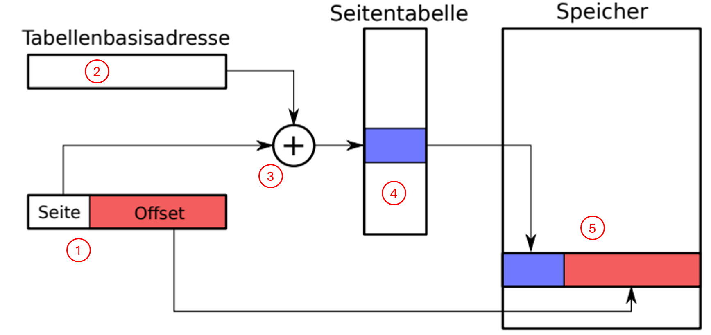

# Woche 5 - Speicherverwaltung

## Arten der Speicherverwaltung
1. Verkettete Liste: Statusinformationen vor jedem Block (Große, frei oder belegt). Kein interner ¨
   Verschnitt, dafur hoher externer Verschnitt, Fragmentierung, lange Suchlaufzeiten. ¨
2. Slab (hier Fokus Betriebssysteme, gibt es aber auch bei Programmiersprachen/Userspace): kmalloc() und Verwandte alloziieren Vielfache der Kachelgroße. Betriebssystem und ¨
   Kerneltreiber nutzen jedoch haufig Strukturen die um Vielfache kleiner sind und meist nur ¨
   kurzlebig: inodes, task structs, semaphores, etc. sodass Nutzung von kmalloc() sehr ineffizient.
   Losung: Nutzung eines globalen Kernel Caching Allokators, welcher f ¨ ur Anfragen von OS und ¨
   Drivern passende Blocke bereith ¨ alt. Somit schnelle Zugriffszeiten und perfekte Ausnutzung des ¨
   Speichers (fast kein Verschnitt). Mogliche Nachteile, einsatzbedingt, siehe VL-Folie. ¨
   Quelle mit guten Darstellungen (leicht veraltet):
   http://www.secretmango.com/jimb/Whitepapers/slabs/slab.html.
3. Buddy Verfahren: auch hier interner Verschnitt groß, und sichtbar mehr Verwaltungsdaten als die anderen, wenig externer Verschnitt.

## Speicherauslastung und Verschnitt
$$
\text{Speicherauslastung} = \frac{\text{Größe des belegten Speichers}}{\text{Größe des gesamten Speichers}}
$$

$$
\text{Interner Verschnitt} = \frac{\text{Größe des belegten, aber nicht genutzten Speichers}}{\text{Größe des belegten Speichers}}
$$

$$
\text{Externer Verschnitt} = \frac{\text{Größe des freien, aber nicht belegten Speichers}}{\text{Größe des belegten Speichers}}
$$

## Page Faults (Seitenfehler)
Page Fault: Programm versucht auf eine Seite zuzugreifen, welche gerade nicht im virtuellen
Adressraum des Prozesses ist (von MMU verwaltet). BS versucht die Seite zugreifbar zu machen
(laden, swap oder abort Programm).
Segmentation Fault: Unberechtigter Speicherzugriff (keine Rechte, Adresse nicht aligned).
Betriebssystem reagiert mit Signal an Prozess, z.B. SIGSEGV (unter UNIXartigen) fur¨ segmentation violation. Programm kann darauf mit eigenem Handler reagieren oder wird terminiert.

:::info[Information]
Eine `NULL`-Pointer Referenz ist typischerweise ein invalid page fault resultierend in einem
Segmentation Fault.
:::

## Virtueller Speicher
1. **Effiziente Nutzung des Speichers**: In einem Computersystem ist der physische Speicher (RAM) oft begrenzt. Durch die Verwendung virtueller Adressen können Betriebssysteme den verfügbaren Speicher effizienter nutzen, indem sie Teile des Speichers auf der Festplatte (Swap-Speicher) als Erweiterung des physischen Speichers nutzen. So kann ein System mehr Programme oder größere Programme ausführen, als es der tatsächliche physische Speicher zulassen würde.

2. **Prozessisolierung**: Jeder Prozess im System erhält seinen eigenen virtuellen Adressraum, der von den Adressräumen anderer Prozesse isoliert ist. Diese Isolierung verhindert, dass ein Prozess die Daten eines anderen Prozesses unerlaubt liest oder verändert, was zur Systemsicherheit und Stabilität beiträgt.

3. **Speicherschutz**: Das Adressübersetzungsverfahren ermöglicht es dem Betriebssystem, Zugriffsrechte für bestimmte Speicherbereiche zu definieren. So kann beispielsweise verhindert werden, dass Anwendungssoftware Schreibzugriffe auf Speicherbereiche ausführt, die für das Betriebssystem oder andere kritische Prozesse reserviert sind.

### Adressübersetzungsverfahren
Das Adressübersetzungsverfahren wird genutzt um virtuelle in physische Speicheradressen zu übersetzen. Das folgende Diagramm illustriert die dafür genutzten Verfahren. Die elementaren Bausteine (1-5) werden folgend auch weiter erklärt. 

1. **Virtuelle Adresse**: Die Virtuelle Adresse ist die, die der Prozess "sieht". Sobald der Prozess auf Speicher zugreifen möchte ...
   Die virtuelle Adresse wird in zwei Teile, nämlich den _Seitenindex_ sowie den _Offset_ aufgeteilt - wie das Verfahrung zur Berechnung der beiden Teile aussieht schauen wir uns gleich an. 
2. **Tabellenbasisadresse**: Diese enthält die - wer hätte es gedacht - Adresse des ersten Eintrags der Seitentabelle. 
3. Die _Seitenzahl_, sowie _Tabellenbasisadresse_ werden addiert um den entsprechenden Eintrag der Seitentabelle bestimmen zu können. 
4. **Seitentabelle**: Die Seitentabelle enthält das _Mapping_ zwischen virtuellen und physischen Adressen. Zusätzlich dazu enthält es weitere Status-Bits um den aktuellen Zustand der Seite zu markieren. (Link zu [XXXXXXX](#status-bits-der-seitentabelle))
5. **Physischer Speicher**: Im physischen Speicher sind die Daten letztendlich gespeichert. Dieses ist in Kacheln unterteilt (typischerweise von 4096 Byte)... USW

---

#### Beispiel
Wir schauen uns nun anhand des folgenden Beispiels die Handsimulation (bzw. das manuelle Übersetzen der Speicheradressen) an. 

:::info[Erinnerung]
Mit $n$ Bits können wir $2^n$ unterschiedliche Werte abbilden. Nämlich alle Zahlen im Intervall: $[0, 2^n-1]$.
:::

Ordnen Sie mithilfe der Seitentabelle den folgenden virtuellen Adressen ihre physische Adresse zu.
Die Seitentabelle hat $2^4 = 16$ Eintrage und liegt in einem (physischen) Speicher von $2^8$ Byte. Die Tabellenbasisadresse ist `0x9E`. Für das erste Beispiel, betrachten wir die virtuelle Adresse `0x2B`. 

1. **Bestimmung der Bitanzahl für Seitennummer und Offset**:

   Da die Seitentabelle $2^4 = 16$ Einträge hat, benötigen wir $4$ Bits, um jede Seite zu identifizieren. Das ermöglicht es uns, jede der $16$ möglichen Seitennummern zu adressieren.

   Der Speicher hat eine Größe von $2^8 = 256$ Byte, und da wir $2^4 = 16$ Seiten haben, ist jede Seite $2^8 / 2^4 = 2^4 = 16$ Byte groß. Um alle möglichen Offsets innerhalb einer Seite zu adressieren, benötigen wir ebenfalls $4$ Bits.

   Die virtuelle Adresse muss daher mindestens $8$ Bits lang sein, um den gesamten physischen Speicher abzudecken.

2. **Aufteilung der virtuellen Adresse `0x2B`**:

   Die ersten $4$ Bits (höherwertige Bits) geben den Seitenindex an, und die letzten $4$ Bits (niederwertige Bits) stellen den Offset dar.

   Für `0x2B`:
   - Seitenindex = `0x2`
   - Offset = `0xB`

3. **Ermittlung der physischen Adresse**:

   Die Tabellenbasisadresse beträgt 0x9E. Um die Adresse in der Seitentabelle zu finden, die dem Seitenindex entspricht, addieren wir den Seitenindex zur Tabellenbasisadresse: `0x9E + 0x2 = 0xA0`.
   Wir suchen dann in der Seitentabelle nach dem Eintrag an der Adresse `0xA0`. Angenommen, dieser Eintrag hat den Wert `0xF`, der die Basisadresse der Seite im physischen Speicher angibt.

4. **Zusammensetzung der physischen Adresse**:

   Die physische Adresse wird gebildet, indem die Basisadresse der Seite im physischen Speicher (`0xF`) mit dem Offset (`0xB`) konkateniert wird. Das ergibt die physische Adresse `0xFB`.

| Speicheradresse | Daten |
|:---------------:|:-----:|
|      0x9A       |  0x4  |
|      0x9B       |  0x5  |
|      0x9C       |  0x2  |
|      0x9D       |  0x1  |
|      0x9E       |  0x0  |
|      0xA0       |  0xF  |
|      0xA1       |  0xA  |
|      0xA2       |  0xC  |
|      0xA3       |  0xD  |

:::danger[Achtung]
Ein Zeichen im Hexadezimalsystem entspricht $4$ Bits. Angenommen wir haben eine Seitentabelle der Größe $2^5$, dann wären die ersten $5$ Bits der Adresse für die Seitennummer bestimmt (es blieben bei einer $8$ Bit virtuellen Adresse dann nur noch $3$ Bits für den Offset). Wenn dies der Fall ist müssen wir die virtuelle Adresse zunächst in ihre Binärdarstellung zerlegen um die ersten $5$ Bits zu identifizieren. Die restlichen Schritte sind analog.  
:::

### Status-Bits der Seitentabelle
