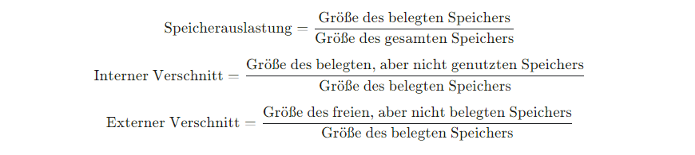

# Woche 5 - Speicherverwaltung

## Arten der Speicherverwaltung
1. Verkettete Liste: Statusinformationen vor jedem Block (Große, frei oder belegt). Kein interner ¨
   Verschnitt, dafur hoher externer Verschnitt, Fragmentierung, lange Suchlaufzeiten. ¨
2. Slab (hier Fokus Betriebssysteme, gibt es aber auch bei Programmiersprachen/Userspace): kmalloc() und Verwandte alloziieren Vielfache der Kachelgroße. Betriebssystem und ¨
   Kerneltreiber nutzen jedoch haufig Strukturen die um Vielfache kleiner sind und meist nur ¨
   kurzlebig: inodes, task structs, semaphores, etc. sodass Nutzung von kmalloc() sehr ineffizient.
   Losung: Nutzung eines globalen Kernel Caching Allokators, welcher f ¨ ur Anfragen von OS und ¨
   Drivern passende Blocke bereith ¨ alt. Somit schnelle Zugriffszeiten und perfekte Ausnutzung des ¨
   Speichers (fast kein Verschnitt). Mogliche Nachteile, einsatzbedingt, siehe VL-Folie. ¨
   Quelle mit guten Darstellungen (leicht veraltet):
   http://www.secretmango.com/jimb/Whitepapers/slabs/slab.html.
3. Buddy Verfahren: auch hier interner Verschnitt groß, und sichtbar mehr Verwaltungsdaten als die anderen, wenig externer Verschnitt.

## Speicherauslastung und Verschnitt

## Page Faults (Seitenfehler)
Page Fault: Programm versucht auf eine Seite zuzugreifen, welche gerade nicht im virtuellen
Adressraum des Prozesses ist (von MMU verwaltet). BS versucht die Seite zugreifbar zu machen
(laden, swap oder abort Programm).
Segmentation Fault: Unberechtigter Speicherzugriff (keine Rechte, Adresse nicht aligned).
Betriebssystem reagiert mit Signal an Prozess, z.B. SIGSEGV (unter UNIXartigen) fur¨ segmentation violation. Programm kann darauf mit eigenem Handler reagieren oder wird terminiert.

:::info[Information]
Eine `NULL`-Pointer Referenz ist typischerweise ein invalid page fault resultierend in einem
Segmentation Fault.
:::

## Virtueller Speicher
1. **Effiziente Nutzung des Speichers**: In einem Computersystem ist der physische Speicher (RAM) oft begrenzt. Durch die Verwendung virtueller Adressen können Betriebssysteme den verfügbaren Speicher effizienter nutzen, indem sie Teile des Speichers auf der Festplatte (Swap-Speicher) als Erweiterung des physischen Speichers nutzen. So kann ein System mehr Programme oder größere Programme ausführen, als es der tatsächliche physische Speicher zulassen würde.

2. **Prozessisolierung**: Jeder Prozess im System erhält seinen eigenen virtuellen Adressraum, der von den Adressräumen anderer Prozesse isoliert ist. Diese Isolierung verhindert, dass ein Prozess die Daten eines anderen Prozesses unerlaubt liest oder verändert, was zur Systemsicherheit und Stabilität beiträgt.

3. **Speicherschutz**: Das Adressübersetzungsverfahren ermöglicht es dem Betriebssystem, Zugriffsrechte für bestimmte Speicherbereiche zu definieren. So kann beispielsweise verhindert werden, dass Anwendungssoftware Schreibzugriffe auf Speicherbereiche ausführt, die für das Betriebssystem oder andere kritische Prozesse reserviert sind.

### Adressübersetzungsverfahren
Das Adressübersetzungsverfahren wird genutzt um virtuelle in physische Speicheradressen zu übersetzen. Das folgende Diagramm illustriert die dafür genutzten Verfahren. Die elementaren Bausteine (1-5) werden folgend auch weiter erklärt. 

1. Virtuelle Adresse: Die Virtuelle Adresse ist die, die der Prozess "sieht"/"nutzt". Sobald der Prozess auf Speicher zugreifen möchte, muss die Adresse übersetzt werden um auf den physischen Speicher zugreifen zu können. Die virtuelle Adresse wird in zwei Teile, nämlich die **Seitennummer** sowie den **Offset** aufgeteilt.
2. Tabellenbasisadresse: Diese enthält die _physische Adresse_ des ersten Eintrags der Seitentabelle. 
3. Der Seitenindex, sowie Tabellenbasisadresse werden addiert um den entsprechenden Eintrag der Seitentabelle bestimmen zu können. Anders gesagt nutzen wir den Seitenindex als _Index_ für die Seitentabelle. Ein Seitenindex von `0x2` würde also den zweiten Eintrag der Seitentabelle "ansprechen".
4. Seitentabelle: Die Seitentabelle enthält die Kachelnummern der dazugehörigen Seitennummer im virtuellen Speicher. Zusätzlich dazu enthält es weitere [Status-Bits](#status-bits-der-seitentabelle) um den aktuellen Zustand der Seite zu markieren.
5. Physischer Speicher: Im physischen Speicher sind die Daten letztendlich gespeichert. Dieses ist in Kacheln (engl. Page Frames) unterteilt. In modernen Architekturen entspricht die Größe der Kacheln oft `4096 Byte` (`4 kB`). 

---

#### Beispiel
Wir schauen uns nun anhand des folgenden Beispiels die Handsimulation (bzw. das manuelle Übersetzen der Speicheradressen) an. 

:::info[Erinnerung]
Mit $n$ Bits können wir $2^n$ unterschiedliche Werte abbilden. Nämlich alle Zahlen im Intervall: $[0, 2^n-1]$.
:::

Ordnen Sie mithilfe der Seitentabelle den folgenden virtuellen Adressen ihre physische Adresse zu.
Die Seitentabelle hat $2^4 = 16$ Eintrage und liegt in einem (physischen) Speicher von $2^8$ Byte. Die Tabellenbasisadresse ist `0x9E`. Für das erste Beispiel, betrachten wir die virtuelle Adresse `0x2B`. 

1. **Bestimmung der Bitanzahl für Seitennummer und Offset**:

   Da die Seitentabelle $2^4 = 16$ Einträge hat, benötigen wir $4$ Bits, um jede Seite zu indizieren.

   Die zu übersetzende Adresse `0x2B` lässt sich also in $8$ Bit (`0010 1011`) darstellen. Wir benötigen $4$ Bit für die Seitennummer. Es bleiben entsprechend $4$ Bit für den Offset übrig. 

   :::info[Erinnerung]
   Jedes "Zeichen" in Hexadezimal lässt sich als $4$ Bits darstellen. So ist bspw. `0xA` = `1010`.
   :::

2. **Aufteilung der virtuellen Adresse `0x2B`**:
   
   `0x2B` = `0010 1011`

   Die ersten $4$ Bits geben die Seitennummer an, und die letzten $4$ Bits stellen den Offset dar.

   - Seitennummer = `0010` = `0x2`
   - Offset = `1011` = `0xB`

3. **Ermittlung der Kachelnummer**:

   Die Tabellenbasisadresse beträgt `0x9E`. Um die Adresse in der Seitentabelle zu finden, die der Seitennummer entspricht, addieren wir den Seitenindex zur Tabellenbasisadresse: `0x9E + 0x2 = 0xA0`.
   Wir suchen dann in der Seitentabelle nach dem Eintrag an der Adresse `0xA0`. Die Kachelnummer an dieser Adresse entspricht `0xF`.

   :::info[Hinweis]
   Wie oben angesprochen nutzen wir die Seitennummer um die Einträge der Seitentabelle zu indizieren. Ähnlich wie in einem C-Array können wir uns die Seitennummer als Array-Index vorstellen. Ausgehend von der Tabellenbasisadresse `0x9E`, ist `0x2` also der dritte (wir zählen ab $0$) Eintrag in der Seitentabelle. Im Beispiel unten wäre das also `0xA2`.
   :::

4. **Zusammensetzung der physischen Adresse**:

   Die physische Adresse wird gebildet, indem wir die Kachelnummer (`0xF`) mit dem aus der virtuellen Adresse berechneten Offset (`0xB`) konkatenieren. Die physische Adresse entspricht also `0xFB`.

| Speicheradresse | Daten |
|:---------------:|:-----:|
|      0x9A       |  0x4  |
|      0x9B       |  0x5  |
|      0x9C       |  0x2  |
|      0x9D       |  0x1  |
|      0x9E       |  0x0  |
|      0xA0       |  0xF  |
|      0xA1       |  0xA  |
|      0xA2       |  0xC  |
|      0xA3       |  0xD  |

Abbildung 1: Beispielhafte Seitentabelle

### Status-Bits der Seitentabelle
Die Seitentabelle enthält, zusätzlich zur Kachelnummer, weitere Metadaten (Status-Bits) die vom Betriebssystem/der CPU genutzt werden. Ein paar Beispiele:
- Präsenzbit (P) - Ist die Seite im Hauptspeicher vorhanden?
- Referenzbit (R) oder Access Bit (A) - Wurde auf die Seite bereits zugegriffen?
- Modifikationsbit (M) oder Dirty Bit (D) - Wurde die Seite modifiziert (bspw. durch Schreiben)?

Ein Beispiel für die Notwendigkeit dieser Bits:
Falls die Seite ausgelagert wird, muss das Betriebssystem wissen, ob die Änderungen im Speicher auf die Festplatte geschrieben werden müssen, oder ob die Seite verworfen werden kann. Dafür wird bspw. das Dirty Bit (D) genutzt.  